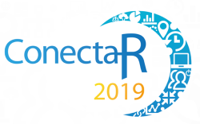
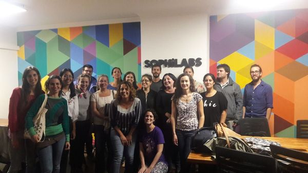
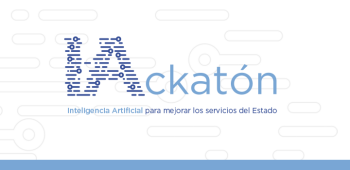
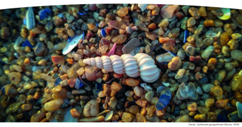

```{r setup, include=FALSE}
options(htmltools.dir.version = FALSE)
```

background-image: url(images/Rlogo.svg)

# Grupo de Usuaries de R - GURU

---

# ConectaR

[www.conectar2019.org](https://www.conectar2019.org) | [@conecta_Rf](https://twitter.com/conecta_R) 

Encuentro Internacional de Usuarios de `R` en Latinoamérica: Conectando Industria, Enseñanza, Ciencia Ciudadana y Ciencia Abierta.

- Fue el 24, 25 y 26 de enero de 2019 en Costa Rica `r emo::ji("costa_rica")`

- La próxima edición de ConectaR será en el 2021.

<br>

.center[]

---

# R-Ladies Montevideo

[rladies-montevideo](https://www.meetup.com/es-ES/rladies-montevideo/) | [@RLadiesMVD](https://twitter.com/RLadiesMVD)

- Organización mundial que promueve la diversidad de género en la comunidad de R.

- El 29 de mayo de 2019 en [@ScanntechUy](https://twitter.com/ScanntechUy) se realizó un **"Taller introductorio a shiny: aplicaciones web interactivas en `R`"** a cargo de Virginia Burguete.

.center[]

---

# GURU Montevideo

[GURU-mvd](https://www.meetup.com/es-ES/GURU-mvd/) | [@gurumvd](https://twitter.com/gurumvd)

- Espacio de intercambio entre los usuarios e interesados en R, donde compartir experiencias, desafíos y desarrollar de la comunidad de `R` en Montevideo.

- El 21 de agosto de 2019 en [@tryolabs](https://twitter.com/tryolabs) se **está realizando!** este evento que tendrá las siguientes charlas:

  - **"Aplicaciones de `R` espacial a políticas sociales"** por Richard Detomasi.
  - **"Investigación social con `R`"** por Daniela de los Santos.
  - **"¿Cuánta a`R`ena hay en la playa? ¿De qué depende? Y... ¿a quién le importa?"** por Luis Orlando.

---

# IA-ckatón

[eventos.agesic.gub.uy](https://eventos.agesic.gub.uy/event/ia-ckaton-red-gealc-2019-07-21-2019-08-21-15/register) | [#IAckatón](https://twitter.com/hashtag/IAckat%C3%B3n)

- Generar, definir y desarrollar proyectos innovadores que mejoren los servicios del Estado apoyados en esta tecnología.

- La competencia será el 30 de agosto y allí será elegido el ganador de Uruguay.

- Posteriormente, este ganador participará junto con los ganadores de los demás países en una final regional que se llevará a cabo el 13 de setiembre.

<br>

.center[]

---

# V Jornadas de Estadística Aplicada

[maren.cure.edu.uy](http://www.maren.cure.edu.uy/jornadas-estadistica/)

- Intercambio de ideas, resultados y avances sobre la modelización estadística en distintas áreas del conocimiento entre investigadores consolidados, investigadores jóvenes y estudiantes provenientes de diferentes disciplinas.

- Ejes temáticos: 
  - Modelos espacio-temporales
  - Epidemiología

- El 13 y 14 de setiembre de 2019 en La Paloma, Rocha `r emo::ji("uruguay")`

.center[]

---

# LatinR

[latin-r.com](http://latin-r.com) | [@LatinR_Conf](https://twitter.com/LatinR_Conf)

- Conferencia Latinoamericana sobre Uso de `R` en Investigación + Desarrollo.

- Del 25 al 27 de setiembre de 2019 en Santiago de Chile `r emo::ji("chile")`

- Oradores principales:

  - **Mine Çetinkaya-Rundel** (Universidad de Duke y RStudio).
  - **Erin LeDell** (H2O.ai, Women+ in Machine Learning & Data Science y co-fundadora de RLadies Global).
  - **Hadley Wickham** (RStudio, Universidad de Auckland, Universidad de Stanford y Universidad de Rice).
  
.center[  ]

---

# Jornadas Nacionales de Estadística (SUE)

[suecontacto@gmail.com](mailto:suecontacto@gmail.com)

- Jornadas de intercambio de la Sociedad Uruguaya de Estadística (SUE)

- Ejes temáticos:
  - Rol de la Estadística en la tiempos de Ciencia de Datos.
  - Talleres sobre: reportes dinámicos y manejo de información geográfica.

- El 4 y 5 de octubre de 2019 en Montevideo `r emo::ji("uruguay")` (Facultad de Economía - UdelaR).

.center[]

---

# Khipu

[khipu.ai](https://khipu.ai) | [@Khipu_AI](https://twitter.com/Khipu_AI)

Encuentro Latinoamericano en Inteligencia Artificial: 

- Entrenamiento avanzado en Machine Learning como deep learning y reinforcement learning.
- Fortalecer la comunidad de Machine Learning.
- Aumentar la conciencia sobre cómo se puede utilizar la IA en beneficio de América Latina.

- Del 11 al 15 de noviembre de 2019 en Montevideo `r emo::ji("uruguay")` (Facultad de Ingeniería - UdelaR).

.center[]


---

# Agradecimientos

- A [Tryolabs](https://tryolabs.com/) por brindarnos este espacio y apoyar la actividad! gracias!!!

.center[]


- Repo de esta presentación: [github.com/guzmanlopez/GURU_slides_21082019](https://github.com/guzmanlopez/GURU_slides_21082019)

.footnote[Realizada con `R` y con `r emo::ji("heart")`]
